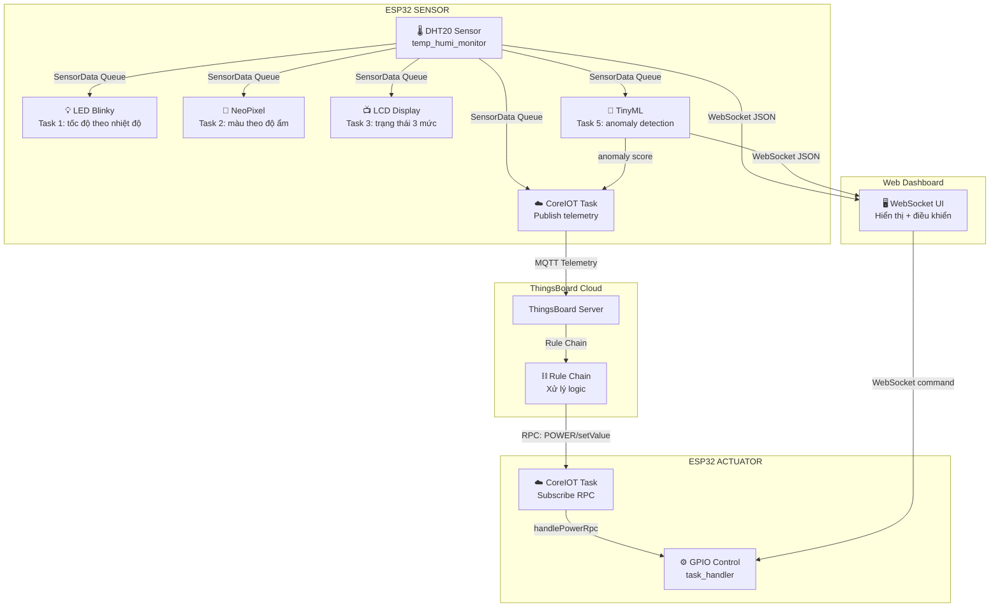
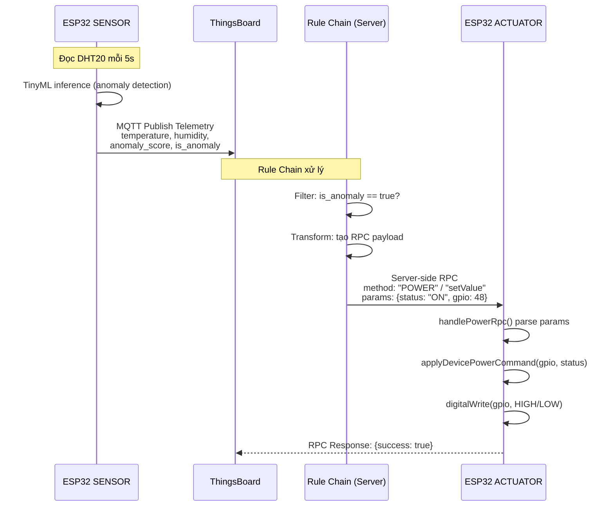
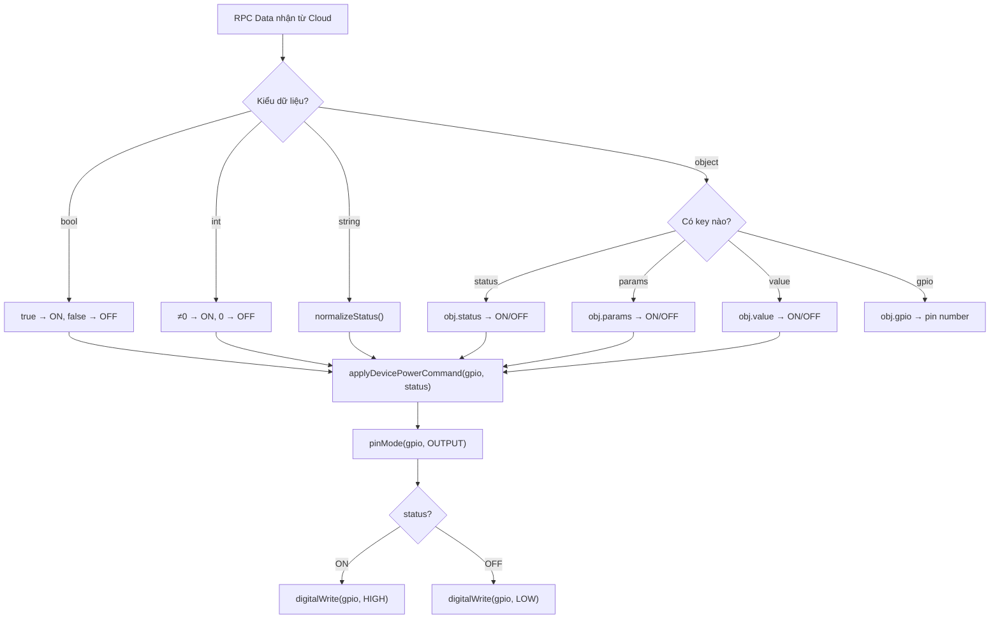
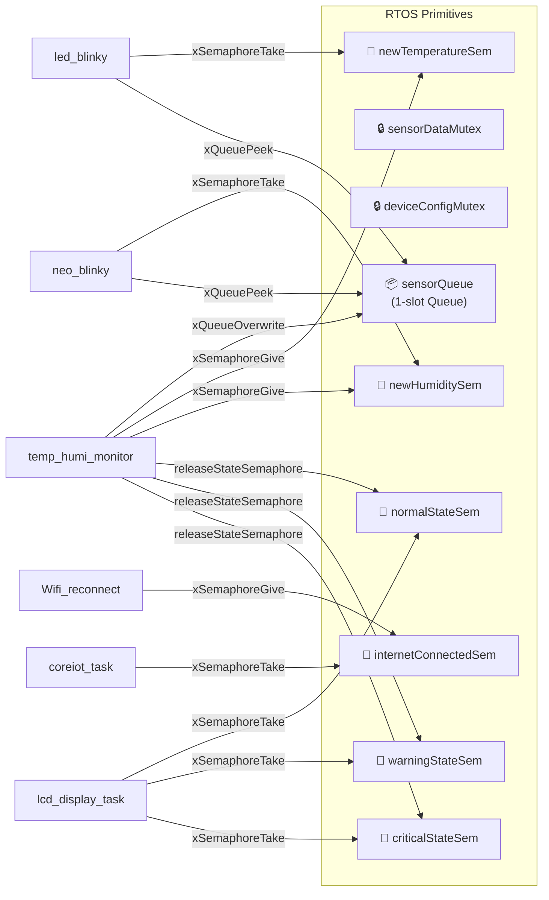
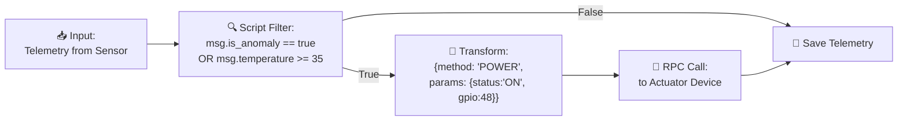

# 📋 Phân Tích Dự Án YoloUNO_PlatformIO

## 1. Tổng Quan Dự Án

Đây là một **hệ thống IoT hoàn chỉnh** chạy trên board **ESP32-S3 (Yolo UNO)** sử dụng **PlatformIO + Arduino Framework + FreeRTOS**. Dự án triển khai kiến trúc **2 thiết bị phối hợp** thông qua nền tảng cloud **ThingsBoard (CoreIOT)**:

| Vai trò | Build Flag | Chức năng |
|---------|-----------|-----------|
| **SENSOR** | `DEVICE_ROLE_SENSOR` | Đọc cảm biến DHT20, chạy TinyML anomaly detection, gửi telemetry lên cloud |
| **ACTUATOR** | `DEVICE_ROLE_ACTUATOR` | Nhận lệnh RPC từ cloud, điều khiển GPIO (bật/tắt thiết bị) |

> [!IMPORTANT]
> Dự án **không có biến global** — toàn bộ state được quản lý qua **accessor functions** + **RTOS primitives** (Queue, Mutex, Semaphore).

---

## 2. Kiến Trúc Hệ Thống



---

## 3. Danh Sách RTOS Tasks

### SENSOR Device (6 tasks)

| # | Task | File | Stack | Chức năng |
|---|------|------|-------|-----------|
| 1 | `led_blinky` | [led_blinky.cpp](file:///c:/Users/tam/Documents/GitHub/YoloUNO_PlatformIO/src/led_blinky.cpp) | 2048 | LED nhấp nháy theo nhiệt độ: Cold (<24°C) → 1s, Normal → 0.5s, Hot (≥30°C) → 125ms |
| 2 | `neo_blinky` | [neo_blinky.cpp](file:///c:/Users/tam/Documents/GitHub/YoloUNO_PlatformIO/src/neo_blinky.cpp) | 4096 | NeoPixel đổi màu theo độ ẩm: Dry (<40%) → amber, Comfort → green, Humid (≥70%) → blue |
| 3 | `lcd_display_task` | [temp_humi_monitor.cpp](file:///c:/Users/tam/Documents/GitHub/YoloUNO_PlatformIO/src/temp_humi_monitor.cpp#L78-L135) | 4096 | LCD I2C hiển thị 3 trạng thái: NORMAL / WARNING (≥30°C or ≥65%) / CRITICAL (≥35°C or ≥80%) |
| 4 | `temp_humi_monitor` | [temp_humi_monitor.cpp](file:///c:/Users/tam/Documents/GitHub/YoloUNO_PlatformIO/src/temp_humi_monitor.cpp#L26-L69) | 4096 | Đọc DHT20 mỗi 5s, publish vào Queue, notify các task khác |
| 5 | `tiny_ml_task` | [tinyml.cpp](file:///c:/Users/tam/Documents/GitHub/YoloUNO_PlatformIO/src/tinyml.cpp) | 8192 | TFLite Micro: nhận [temp, humi], output anomaly score (≥0.5 = anomaly) |
| 6 | `coreiot_task` | [task_core_iot.cpp](file:///c:/Users/tam/Documents/GitHub/YoloUNO_PlatformIO/src/task_core_iot.cpp) | 6144 | Gửi telemetry lên ThingsBoard: temperature, humidity, anomaly_score, is_anomaly, GPS |

### ACTUATOR Device (1 task)

| # | Task | File | Stack | Chức năng |
|---|------|------|-------|-----------|
| 1 | `coreiot_task` | [task_core_iot.cpp](file:///c:/Users/tam/Documents/GitHub/YoloUNO_PlatformIO/src/task_core_iot.cpp) | 6144 | Subscribe RPC callbacks, nhận lệnh bật/tắt GPIO |

---

## 4. ⛓️ Phân Tích Chi Tiết: Rule Chain

> [!NOTE]
> "Rule Chain" trong ngữ cảnh dự án này là cơ chế **ThingsBoard Rule Chain** — một pipeline xử lý logic phía server. Trong code ESP32, phần tương ứng là luồng **Telemetry → Cloud → RPC → Actuator**.

### 4.1 Luồng dữ liệu Rule Chain



### 4.2 Phía SENSOR — Gửi Telemetry

File: [task_core_iot.cpp:113-137](file:///c:/Users/tam/Documents/GitHub/YoloUNO_PlatformIO/src/task_core_iot.cpp#L113-L137)

```cpp
// Dữ liệu được gửi lên ThingsBoard mỗi 10 giây:
tb.sendTelemetryData("temperature", data.temperature);
tb.sendTelemetryData("humidity", data.humidity);
tb.sendTelemetryData("anomaly_score", mlState.lastScore);
tb.sendTelemetryData("is_anomaly", mlState.isAnomaly);
tb.sendTelemetryData("lat", 10.772175);    // GPS cố định
tb.sendTelemetryData("long", 106.657891);
```

> [!TIP]
> Đây là **input** cho Rule Chain trên ThingsBoard. Rule Chain sẽ dựa vào các giá trị này (đặc biệt `is_anomaly`, `temperature`) để quyết định có gửi RPC xuống Actuator hay không.

### 4.3 Phía ACTUATOR — Nhận RPC

File: [task_core_iot.cpp:85-111](file:///c:/Users/tam/Documents/GitHub/YoloUNO_PlatformIO/src/task_core_iot.cpp#L85-L111)

ESP32 Actuator subscribe **3 RPC method names** để tương thích với nhiều cách gọi từ Rule Chain:

| RPC Method | Mô tả |
|------------|--------|
| `"POWER"` | Tên method chuẩn viết hoa |
| `"power"` | Tương thích viết thường |
| `"setValue"` | Tương thích ThingsBoard widget |

```cpp
RPC_Callback powerCallback("POWER", handlePowerRpc);
RPC_Callback powerLowerCallback("power", handlePowerRpc);
RPC_Callback setValueCallback("setValue", handlePowerRpc);
```

### 4.4 Xử Lý RPC — Core Logic

File: [task_handler.cpp](file:///c:/Users/tam/Documents/GitHub/YoloUNO_PlatformIO/src/task_handler.cpp)

Đây là **trái tim** của phần Rule Chain phía device. Hàm `handlePowerRpc()` parse nhiều dạng payload JSON:



> [!IMPORTANT]
> Hàm `rpcParamToStatus()` được thiết kế **cực kỳ linh hoạt** — nó chấp nhận **6 dạng payload** khác nhau từ ThingsBoard Rule Chain:
> 
> 1. `true` / `false` (bool)
> 2. `1` / `0` (int)  
> 3. `"ON"` / `"OFF"` / `"TRUE"` / `"FALSE"` (string)
> 4. `{"status": true}` (object với key "status")
> 5. `{"params": "ON"}` (object với key "params")
> 6. `{"value": 1}` (object với key "value")
>
> GPIO mặc định là **pin 48** nếu không có trường `gpio` trong payload.

### 4.5 Kênh điều khiển thứ 2 — WebSocket (Local)

Ngoài Rule Chain cloud, dự án còn có **kênh điều khiển local** qua WebSocket dashboard:

File: [task_handler.cpp:123-167](file:///c:/Users/tam/Documents/GitHub/YoloUNO_PlatformIO/src/task_handler.cpp#L123-L167)

```
WebSocket message → handleWebSocketMessage()
  ├── page == "device"  → applyDevicePowerCommand(gpio, status)
  └── page == "setting" → Save_info_File() → ESP.restart()
```

---

## 5. RTOS Synchronization Map



---

## 6. Cấu Hình Rule Chain trên ThingsBoard

> [!WARNING]
> Code ESP32 chỉ xử lý **phía device** của Rule Chain. Phần cấu hình **phía server ThingsBoard** (các node filter, transform, RPC call) cần được thiết lập trên giao diện web ThingsBoard. Dự án **không chứa file export Rule Chain** (`.json`).

### Gợi ý cấu hình Rule Chain trên ThingsBoard:



**Rule Chain gợi ý cần tạo:**
1. **Message Type Filter** → chỉ xử lý `Post telemetry`
2. **Script Filter** → kiểm tra `msg.is_anomaly == true` hoặc `msg.temperature >= 35`
3. **Transform** → tạo RPC payload `{method: "POWER", params: {status: "ON", gpio: 48}}`
4. **RPC Call Request** → gửi đến Actuator device
5. **Save Telemetry** → lưu data để hiển thị dashboard

---

## 7. Tóm Tắt

| Thành phần | Trạng thái | File chính |
|-----------|-----------|------------|
| Sensor → Queue → LED/Neo/LCD | ✅ Hoàn chỉnh | `temp_humi_monitor.cpp`, `led_blinky.cpp`, `neo_blinky.cpp` |
| TinyML anomaly detection | ✅ Hoàn chỉnh | `tinyml.cpp` + `dht_anomaly_model.h` |
| Telemetry → ThingsBoard | ✅ Hoàn chỉnh | `task_core_iot.cpp` (SENSOR branch) |
| RPC Subscribe + GPIO control | ✅ Hoàn chỉnh | `task_core_iot.cpp` (ACTUATOR branch) + `task_handler.cpp` |
| WebSocket Dashboard (local) | ✅ Hoàn chỉnh | `task_webserver.cpp` + `data/` |
| WiFi + Config persistence | ✅ Hoàn chỉnh | `task_wifi.cpp` + `task_check_info.cpp` |
| **Rule Chain config (server)** | ⚠️ Chưa có | Cần tạo trên ThingsBoard UI |
| RTOS: zero globals | ✅ Hoàn chỉnh | `global.cpp` / `global.h` |
